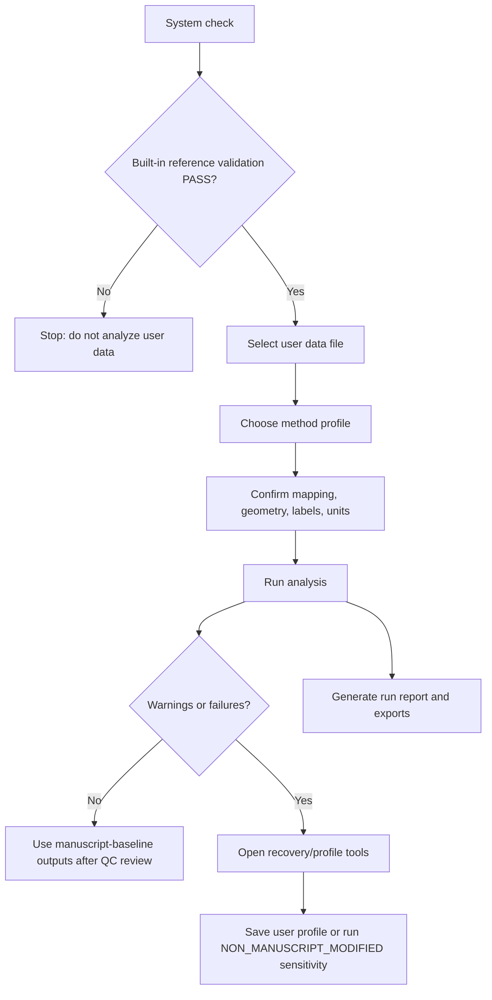

# Peel Trace Evaluation for Soft Substrates — v1.4.0-rc7 

<a href="https://doi.org/10.5281/zenodo.20278328"></a>
[](https://mybinder.org/v2/gh/VCU-Soft-Functional-Materials-Lab/Peel-Trace-Evaluation-for-Soft-Substrates/main?filepath=Peel_Trace_Evaluation_for_Soft_Substrates.ipynb)

**Peel Trace Evaluation for Soft Substrates** is a manuscript-baseline Jupyter/Colab workflow for analyzing force–displacement peel traces from soft textiles, flexible laminates, wearable-device prototypes, pressure-sensitive adhesive systems, and related compliant bonded materials.

The notebook converts raw peel traces into protocol-defined descriptors of force level, initiation force, force-trace stability, stick–slip amplitude, displacement/break proxy, and group repeatability. It is designed to support reproducible adhesive screening when a single average peel force is not sufficient to describe trace behavior.

## What this tool does

The default workflow computes the manuscript metrics only:

- `Fc/w`: width-normalized continuing peel-force descriptor
- `Fci/w`: width-normalized initiation/restart-force descriptor
- `PSI`: Peel Stability Index, defined as selected-window mean force divided by selected-window sample standard deviation
- `SSA`: stick–slip amplitude, defined as mean retained Top5 maxima minus mean retained Bottom5 minima
- selected-window CV, drift ratio, peak/trough counts, extrema-spread quality flags, and displacement/break proxy
- group means, sample standard deviations, coefficients of variation, and output consistency checks

The tool does **not** compute IC-Peel, Kendall, `Gc`, or `Gci` outputs by default.

## Interpretation boundary

The outputs are **protocol-defined descriptors** of the measured peel response under the specified specimen geometry, test protocol, and analysis settings. They are not intrinsic adhesive material constants. Peel traces from soft substrates can reflect interfacial separation, peel-arm deformation, compliance, viscoelastic/plastic dissipation, stick–slip, and instrument/test configuration.

## Manuscript-guided baseline

The locked manuscript baseline uses:

| Parameter | Locked value |
|---|---:|
| start offset | 5.0 mm |
| window length | 25.0 mm |
| terminal exclusion | final 20% of displacement span |
| drift gate | `abs(m) * Lwin / Fbar_win <= 0.25` |
| peak prominence | `0.003 × global maximum corrected force` |
| minimum selected-window points | 10 |
| required peaks/troughs | ≥5 peaks and ≥5 troughs |
| break/drop proxy | post-window `0.10 × Fc`, 1-point detection; final recorded displacement fallback if no drop is found |
| extrema-spread QC | advisory in manuscript baseline; optional hard fail only in modified mode |

The backend protects these analysis-sensitive settings through a locked method-profile hash.

## Modified / recovery runs

Modified settings are allowed only as `NON_MANUSCRIPT_MODIFIED` recovery or sensitivity runs. These outputs should not be mixed with manuscript-baseline results unless explicitly disclosed.

The notebook can suggest global recovery settings from baseline diagnostics. These suggestions are based on trace feasibility and QC flags, not on optimizing adhesive rankings.

## Input data

Accepted formats:

- `.xlsx`
- `.xlsm`
- `.xls`
- `.csv`

Plain `.txt` files are not accepted in the main workflow because delimiter conventions and column metadata vary widely. Convert instrument `.txt` exports to `.csv` or Excel before use.

The notebook scans sheets for force and displacement columns and lets the user confirm or correct:

- sheet inclusion/exclusion
- force column
- displacement column
- force unit (`N`, `mN`, `lbf`)
- displacement unit (`mm`, `cm`, `in`, `um`)
- group label
- adhesive label

## Output files

Typical outputs include:

| File | Purpose |
|---|---|
| `analysis_report.xlsx` | Main human-readable report with metrics, summaries, formulas, diagnostics, and audits |
| `paper_metrics.csv` | Per-trace manuscript metrics and quality flags |
| `group_summary.csv` | Group-level mean, sample SD, CV, and replicate count |
| `diagnostic_summary.csv` | Separates user-run analysis status, metric-quality status, and export integrity; built-in reference validation is handled separately in Step 1 |
| `issue_action_table.csv` | Maps common failures/warnings to conservative next actions |
| `validation_count_summary.csv` | Explains the number and purpose of validation/audit checks |
| `output_consistency_audit.csv` | Confirms exported CSV/Excel values match in-memory calculated tables |
| `formula_dictionary.csv` | Metric equations, units, and interpretations |
| `metric_guide.csv` | Plain-language interpretation notes and limitations |
| `qc_plots/` | Full-trace and selected-window plots with Top5/Bot5 extraction points |
| `provenance.json` | Software version, timestamp, input hash, method profile, and output paths |
| `manuscript_baseline_outputs.zip` | Single archive containing key outputs |

## Built-in validation

The notebook includes a Scotch Tape T-peel validation workbook. In the v1.4.0-rc7 backend test, the validation produced:

- Scotch expected-output validation: `33/33 PASS`
- Output consistency audit: `194/194 PASS`

The exact output-consistency count is dynamic because it depends on exported table schemas and available outputs. Export consistency confirms file-writing integrity; it does not replace QC review of the traces.

## Recommended workflow

1. Run setup and built-in reference validation. Later steps are blocked unless this passes.
2. Select or upload a real force-displacement data file. Profile, benchmark, template, and prior-output files are filtered out of the raw-data selector.
3. Scan and confirm sheet mapping: columns, units, include/exclude choices, geometry, group labels, adhesive labels, and notes.
4. Choose the analysis profile: read-only `manuscript_baseline_v1`, a saved user profile, or a newly created user profile. The user-profile editor is hidden unless create/edit mode is selected.
5. Run the analysis and inspect compact diagnostics, QC plots, and export integrity.
6. Optionally use recovery/sensitivity tools to compare the active profile with suggested global recovery settings.
7. Use the reproducibility manager only after a trusted run to create or validate user benchmarks and review next-step guidance.

## Troubleshooting notes

- If a trace fails because no 25 mm window is valid, inspect displacement units and trace length first.
- If extrema are incomplete, do not force Top5/Bot5 metrics without visual evidence that real oscillations were missed.
- If extrema are clustered, inspect the QC plot; the metric may represent local noise or a single macroscopic hump rather than distributed stick–slip events.
- If output consistency fails, do not use the exported CSV/Excel outputs until rerunning or debugging.
- If no post-window break/drop is detected, the final recorded displacement is used as a terminal-displacement fallback and explicitly flagged.

## Citation and license

If you use this software, please cite the archived Zenodo release:

**Peel Trace Evaluation for Soft Substrates — v1.4.0-rc7**  
Zenodo. https://doi.org/10.5281/zenodo.20278328

The software code is released under the Apache License 2.0. See `LICENSE` for details.


## v1.4.0-rc7 release-candidate additions

This release-candidate focuses on final interface guardrails before GitHub/Binder packaging. It keeps the manuscript method stable while improving profile selection, window-feasibility warnings, user-benchmark separation, and compact default outputs.

### Key rc6 behavior

- `manuscript_baseline_v1` is read-only. Its edit panel is hidden.
- User profiles have `profile_id`, `display_name`, and `profile_note`. Saved files are named like `user_profile_<profile_id>.json`.
- The profile loader detects `user_profile_*.json`, `user_method_profile_*.json`, and `profile_*.json`, while ignoring templates, benchmark files, and manuscript-baseline files.
- Before activating a user profile, the notebook estimates window feasibility from scanned trace travel after start/tail guards.
- If a selected window is longer than the minimum estimated feasible travel, the notebook shows a caution that some sheets may fail.
- If a selected window is shorter than half of the 25 mm manuscript window, the notebook labels it as advanced/manual sensitivity analysis.
- Built-in Scotch reference validation belongs only to Step 1 and blocks later cells if it is not PASS. It is not mixed into user-run diagnostic tables.
- User benchmarks live in the final reproducibility manager and never overwrite the bundled Scotch reference files.

### Rerun map

- New data file: return to Step 2.
- Change columns, units, labels, included sheets, or geometry: return to Step 3.
- Change baseline/profile comparison: return to Step 4.
- Rerun analysis with current confirmed settings: run Step 5 again. If nothing changed, the notebook warns that the rerun will duplicate the previous analysis.
- Recovery/sensitivity/profile tuning: use Step 6 after reviewing diagnostics.
- Create or validate a user benchmark: use Step 7 after a trusted run.

### Decision map




## v1.4.0-rc7 interface-control notes

This release candidate adds several notebook-facing safeguards before public GitHub/Binder testing:

- Confirmed file, mapping, and profile panels collapse after confirmation to reduce visual clutter.
- Step 3 batch editing can now include/exclude selected sheets and apply geometry, labels, notes, and common units.
- Step 4 profile selection includes sheet-aware window-feasibility cautions based on the current mapping.
- Step 5 blocks exact duplicate reruns unless the user explicitly asks to run again.
- Step 6 blocks duplicate non-manuscript modified runs with unchanged file, mapping, profile parameters, and backend version.
- Detailed audit tables are truncated in the notebook view and saved fully to CSV/Excel.
- Built-in reference validation remains separate from user-run diagnostics; downstream cells require Step 1 PASS.


## GitHub repository layout used in rc7

This release also includes a GitHub-ready repository ZIP. The root-level notebook and backend are kept at the repository root so Binder, Colab, and local Jupyter can run without path edits. Supporting files are duplicated into organized folders for clarity.

```text
peel-trace-evaluation-soft-substrates/
├── README.md
├── LICENSE
├── CITATION.cff
├── requirements.txt
├── runtime.txt
├── Peel_Trace_Evaluation_for_Soft_Substrates.ipynb
├── fabric_peel_guided_core_v1_4_0_rc7.py
├── ScothTapeTpeel.xlsx
├── validation_data/
├── method_profiles/
├── templates/
└── docs/
```

Use the root notebook for Binder/Colab. Keep the built-in Scotch reference file read-only; create separate `user_profile_*.json` and `user_benchmark_*.csv/json` files for local datasets.
