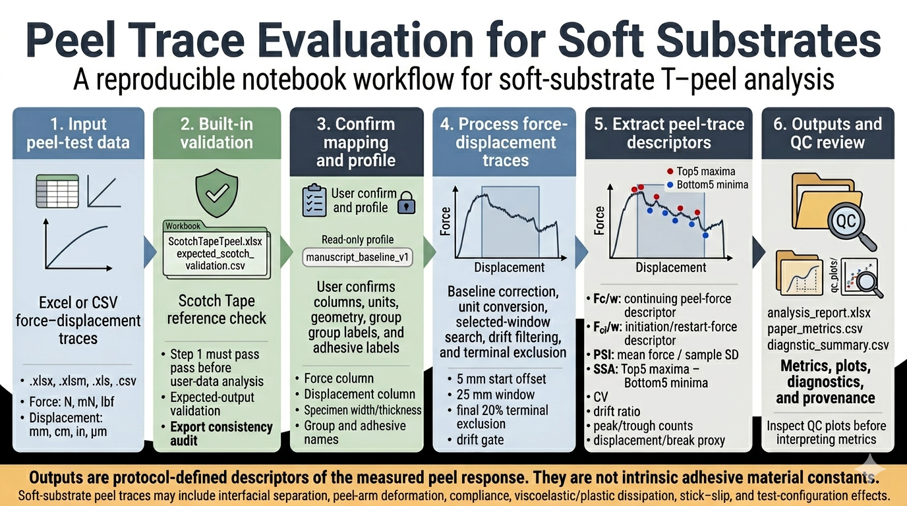
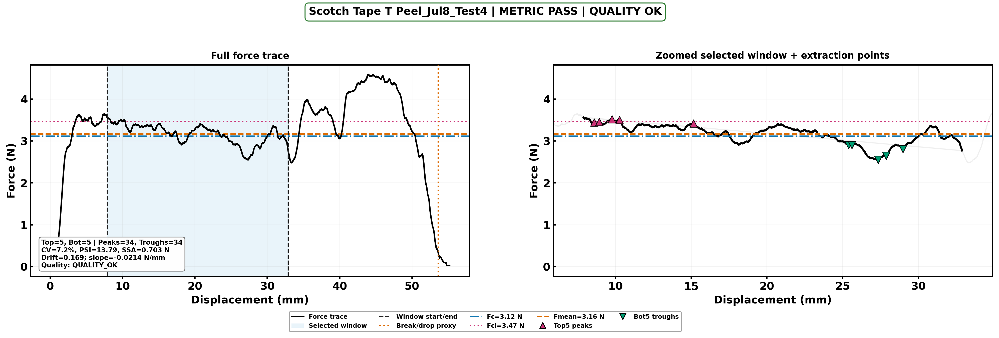

# Peel Trace Evaluation for Soft Substrates

[](https://doi.org/10.5281/zenodo.20278327)
[](https://mybinder.org/v2/gh/VCU-Soft-Functional-Materials-Lab/Peel-Trace-Evaluation-for-Soft-Substrates/main?urlpath=tree/Peel_Trace_Evaluation_for_Soft_Substrates.ipynb)
[](https://colab.research.google.com/github/VCU-Soft-Functional-Materials-Lab/Peel-Trace-Evaluation-for-Soft-Substrates/blob/main/Peel_Trace_Evaluation_for_Soft_Substrates.ipynb)


Manuscript-baseline release: `v1.4.0-rc15`

**Multi-criteria peel-trace analysis for soft substrates.**  
This repository provides a reproducible Jupyter workflow for analyzing force–displacement peel traces from **soft textiles, flexible laminates, wearable-device prototypes, pressure-sensitive adhesive systems, and related compliant bonded materials**.

The workflow is designed for cases where average peel force alone can hide important behavior, including initiation/restart events, force-trace instability, stick–slip oscillations, drift, and poor replicate repeatability. The notebook extracts protocol-defined descriptors of peel force, initiation/restart force, force-trace stability, stick–slip amplitude, displacement/break behavior, diagnostics, and provenance.

<p align="center">
  
</p>

**Figure.** Workflow overview for the Peel Trace Evaluation for Soft Substrates repository. The notebook validates a built-in Scotch Tape reference file, guides user-data mapping and profile selection, processes force–displacement traces, extracts protocol-defined peel descriptors, and exports QC plots, metrics, diagnostics, and provenance records.

This repository supports the manuscript-baseline workflow associated with *Multi-Criteria Selection of Adhesives for Wearable Textiles*.

## Example outputs

The notebook exports QC plots and tabular reports so numerical metrics can be checked against the original force trace before interpretation.

<p align="center">
  
</p>

**Example QC plot.** Representative force–displacement trace output showing the processed peel trace, selected analysis region, Top5/Bot5 extraction points, force-level descriptors, and extraction diagnostics used to check whether the numerical metrics are mechanically interpretable.

| Output | Purpose |
|---|---|
| Full-trace QC plot | Shows the baseline-corrected force trace, selected analysis window, break/drop proxy, and extraction status. |
| Selected-window plot | Shows the retained maxima/minima used for initiation force, continuing force, and stick–slip amplitude calculations. |
| `analysis_report.xlsx` | Consolidates metrics, diagnostics, validation checks, output-consistency checks, and provenance records. |
| `run_manifest.json` | Records runtime, input, profile, and output metadata for reproducibility. |

Additional output definitions are provided in [`docs/OUTPUT_GUIDE.md`](docs/OUTPUT_GUIDE.md).

## Quick start

### Option 1: Run in Binder

Click the **Launch Binder** badge at the top of this README.

Open:

`Peel_Trace_Evaluation_for_Soft_Substrates.ipynb`

Then run the notebook cells in order from Step 0 through Step 7.

Binder launches the full repository environment, including the backend Python file, validation data, and required package environment.

### Option 2: Run in Google Colab

Click the **Open in Colab** badge at the top of this README.

Then run **Step 0** first. In Colab, the notebook automatically clones the repository if the backend file is not already available. This makes Colab behave more like Binder without requiring the user to manually set up the repository.

After Step 0 finishes successfully, continue running the notebook cells in order from Step 1 through Step 7.

Note: Colab uses its own preinstalled scientific Python stack. The notebook does not force-install the full `requirements.txt` file inside Colab because replacing NumPy/SciPy in an active Colab runtime can cause package mismatch errors.

### Option 3: Run locally

Clone the repository:

```bash
git clone https://github.com/VCU-Soft-Functional-Materials-Lab/Peel-Trace-Evaluation-for-Soft-Substrates.git
cd Peel-Trace-Evaluation-for-Soft-Substrates
```

Create a virtual environment:

```bash
python -m venv .venv
```

Activate the environment.

Windows:

```bash
.venv\Scripts\activate
```

macOS/Linux:

```bash
source .venv/bin/activate
```

Install the required packages:

```bash
pip install -r requirements.txt
pip install jupyterlab
```

The Python package dependencies are listed in [`requirements.txt`](requirements.txt). The listed versions reflect the environment used for the manuscript-baseline workflow and Binder-compatible execution.

Start Jupyter:

```bash
jupyter lab
```

Open:

`Peel_Trace_Evaluation_for_Soft_Substrates.ipynb`

Run the notebook cells in order.

### Which file should I run?

Run the notebook:

`Peel_Trace_Evaluation_for_Soft_Substrates.ipynb`

Do not run the backend file directly:

`fabric_peel_guided_core_v1_4_0_rc15.py`

The backend file is imported automatically by the notebook.

## What this tool does

The default workflow computes the manuscript metrics only:

- `Fc/w`: width-normalized continuing peel-force descriptor
- `Fci/w`: width-normalized initiation/restart-force descriptor
- `PSI`: Peel Stability Index, defined as selected-window mean force divided by selected-window sample standard deviation
- `SSA`: stick–slip amplitude, defined as mean retained Top5 maxima minus mean retained Bottom5 minima
- selected-window CV, drift ratio, peak/trough counts, extrema-spread quality flags, and displacement/break proxy
- group means, sample standard deviations, coefficients of variation, and output consistency checks

The tool does **not** compute IC-Peel, Kendall, `Gc`, or `Gci` outputs by default.

## Interpretation boundary

The outputs are **protocol-defined descriptors** of the measured peel response under the specified specimen geometry, test protocol, and analysis settings. They are not intrinsic adhesive material constants. Peel traces from soft substrates can reflect interfacial separation, peel-arm deformation, compliance, viscoelastic/plastic dissipation, stick–slip, and instrument/test configuration.

## Manuscript-guided baseline

The locked manuscript baseline uses:

| Parameter | Locked value |
|---|---:|
| start offset | 5.0 mm |
| window length | 25.0 mm |
| terminal exclusion | final 20% of displacement span |
| drift gate | `abs(m) * Lwin / Fbar_win <= 0.25` |
| peak prominence | `0.003 × global maximum corrected force` |
| minimum selected-window points | 10 |
| required peaks/troughs | ≥5 peaks and ≥5 troughs |
| break/drop proxy | post-window `0.10 × Fc`, 1-point detection; final recorded displacement fallback if no drop is found |
| extrema-spread QC | advisory in manuscript baseline; optional hard fail only in modified mode |

The backend protects these analysis-sensitive settings through a locked method-profile hash.

## Modified / recovery runs

Modified settings are allowed only as `NON_MANUSCRIPT_MODIFIED` recovery or sensitivity runs. These outputs should not be mixed with manuscript-baseline results unless explicitly disclosed.

The notebook can suggest global recovery settings from baseline diagnostics. These suggestions are based on trace feasibility and QC flags, not on optimizing adhesive rankings.

For details on the locked manuscript-baseline profile, user-created profiles, and modified-profile reporting rules, see [`docs/METHOD_PROFILE.md`](docs/METHOD_PROFILE.md).

## Required input data

The input file must contain at least one force column and one displacement column for each peel trace. The notebook scans Excel sheets or CSV files and lets the user confirm the correct columns before analysis.

Accepted formats:

- `.xlsx`
- `.xlsm`
- `.xls`
- `.csv`

Plain `.txt` files are not accepted in the main workflow because delimiter conventions and column metadata vary widely. Convert instrument `.txt` exports to `.csv` or Excel before use.

The notebook lets the user confirm or correct:

- sheet inclusion/exclusion
- force column
- displacement column
- force unit (`N`, `mN`, `lbf`)
- displacement unit (`mm`, `cm`, `in`, `um`)
- specimen width
- specimen thickness
- group label
- adhesive label
- optional notes

Typical force columns may be reported in `N`, `mN`, or `lbf`. Typical displacement columns may be reported in `mm`, `cm`, `in`, or `um`. The notebook converts confirmed units before metric extraction.

Do not upload profile files, benchmark files, template files, prior-output files, or release-note files as raw data. The raw-data selector is intended for real force-displacement peel-test data.


## Output files

Typical outputs include:

| File | Purpose |
|---|---|
| `analysis_report.xlsx` | Main human-readable report with metrics, summaries, formulas, diagnostics, and audits |
| `paper_metrics.csv` | Per-trace manuscript metrics and quality flags |
| `group_summary.csv` | Group-level mean, sample SD, CV, and replicate count |
| `diagnostic_summary.csv` | Separates user-run analysis status, metric-quality status, and export integrity; built-in reference validation is handled separately in Step 1 |
| `issue_action_table.csv` | Maps common failures/warnings to conservative next actions |
| `validation_count_summary.csv` | Explains the number and purpose of validation/audit checks |
| `output_consistency_audit.csv` | Confirms exported CSV/Excel values match in-memory calculated tables |
| `formula_dictionary.csv` | Metric equations, units, and interpretations |
| `metric_guide.csv` | Plain-language interpretation notes and limitations |
| `qc_plots/` | Full-trace and selected-window plots with Top5/Bot5 extraction points |
| `provenance.json` | Software version, timestamp, input hash, method profile, and output paths |
| `manuscript_baseline_outputs.zip` | Single archive containing key outputs |

## Which outputs should I inspect first?

After a successful run, start with these outputs:

1. `analysis_report.xlsx` — main human-readable workbook with metrics, summaries, diagnostics, formulas, and audits.
2. `paper_metrics.csv` — per-trace manuscript-baseline metrics and quality flags.
3. `group_summary.csv` — group-level means, sample standard deviations, coefficients of variation, and replicate counts.
4. `qc_plots/` — trace-level plots showing the selected window and Top5/Bottom5 extraction points.
5. `diagnostic_summary.csv` — run-status, metric-quality, and export-integrity diagnostics.

Use the QC plots before interpreting the numerical metrics. The selected window, retained peaks, and retained valleys should be visually reasonable for the trace.

For a detailed explanation of all output files, see [`docs/OUTPUT_GUIDE.md`](docs/OUTPUT_GUIDE.md).

## Built-in validation

The notebook includes a Scotch Tape T-peel validation workbook. In the v1.4.0-rc15 backend test, the validation produced:

- Scotch Tape expected-output validation: `33/33 PASS`
- Output consistency audit: `194/194 PASS`

The exact output-consistency count is dynamic because it depends on exported table schemas and available outputs. Export consistency confirms file-writing integrity; it does not replace QC review of the traces.
The repository also includes a GitHub Actions workflow for automated Scotch Tape reference validation. This workflow runs the backend manuscript-baseline pipeline against the bundled Scotch Tape validation workbook and fails if the generated validation table reports any failed validation rows.

## Recommended workflow

1. Open `Peel_Trace_Evaluation_for_Soft_Substrates.ipynb`.
2. Run **Step 0** to load packages, initialize the notebook, and import the backend.
3. Run **Step 1** to validate the bundled Scotch Tape reference file. Later analysis steps are blocked unless this validation passes.
4. Run **Step 2** to upload or select the real force-displacement data file.
5. Run **Step 3** to confirm sheet inclusion, force and displacement columns, units, specimen geometry, group labels, adhesive labels, and notes.
6. Run **Step 4** to choose the analysis profile. Use the read-only `manuscript_baseline_v1` profile for manuscript-baseline analysis.
7. Run **Step 5** to generate per-trace metrics, group summaries, QC plots, diagnostic tables, export audits, and the output archive.
8. Use **Step 6** only for recovery or sensitivity analysis. These outputs are labeled `NON_MANUSCRIPT_MODIFIED` and should not be mixed with manuscript-baseline outputs unless explicitly disclosed.
9. Use **Step 7** only after a trusted run to review reproducibility guidance or create optional user benchmarks.

For a more detailed step-by-step guide, see [`docs/WORKFLOW.md`](docs/WORKFLOW.md).

## Troubleshooting notes

- If a trace fails because no 25 mm window is valid, inspect displacement units and trace length first.
- If extrema are incomplete, do not force Top5/Bot5 metrics without visual evidence that real oscillations were missed.
- If extrema are clustered, inspect the QC plot; the metric may represent local noise or a single macroscopic hump rather than distributed stick–slip events.
- If output consistency fails, do not use the exported CSV/Excel outputs until rerunning or debugging.
- If no post-window break/drop is detected, the final recorded displacement is used as a terminal-displacement fallback and explicitly flagged.

For detailed troubleshooting guidance, see [`docs/TROUBLESHOOTING.md`](docs/TROUBLESHOOTING.md).

## Repository layout

The root-level notebook and backend are kept at the repository root so Binder, Colab, and local Jupyter can run without path edits. Supporting files are organized into folders for method profiles, templates, validation data, and documentation.
```text
    Peel-Trace-Evaluation-for-Soft-Substrates/
    ├── README.md
    ├── CHANGELOG.md
    ├── CONTRIBUTING.md
    ├── LICENSE
    ├── CITATION.cff
    ├── .editorconfig
    ├── .gitattributes
    ├── .gitignore
    ├── .github/
    │   ├── CODEOWNERS
    │   ├── pull_request_template.md
    │   └── workflows/
    │       ├── notebook-check.yml
    │       └── scotch-validation.yml
    ├── requirements.txt
    ├── runtime.txt
    ├── Peel_Trace_Evaluation_for_Soft_Substrates.ipynb
    ├── fabric_peel_guided_core_v1_4_0_rc15.py
    ├── ScotchTapeTpeel.xlsx
    ├── validation_data/
    │   ├── ScotchTapeTpeel.xlsx
    │   └── expected_scotch_validation.csv
    ├── method_profiles/
    │   └── manuscript_baseline_v1.json
    ├── templates/
    │   ├── group_defaults_template.csv
    │   ├── sheet_mapping_template.csv
    │   ├── user_benchmark_expected_template.csv
    │   ├── user_benchmark_metadata_template.json
    │   └── user_method_profile_template.json
    └── docs/
        ├── README.md
        ├── WORKFLOW.md
        ├── OUTPUT_GUIDE.md
        ├── TROUBLESHOOTING.md
        ├── METHOD_PROFILE.md
        ├── RELEASE_CHECKLIST.md
        ├── GOVERNANCE.md
        ├── MAINTAINERS.md
        ├── peel_trace_workflow_overview.png
        └── example_outputs/
            └── scotch_tape_qc_trace.png
```
The root-level Scotch Tape workbook is retained for notebook/Binder compatibility, while `validation_data/` stores the organized validation workbook and expected-output reference file used by automated reference validation.

Use the root notebook for Binder, Colab, and local Jupyter. Keep the built-in Scotch Tape reference file read-only. Create separate `user_profile_*.json` and `user_benchmark_*.csv/json` files for local datasets.

For the full documentation index, see [`docs/README.md`](docs/README.md).

## Version notes

The v1.4.0-rc15 release candidate preserves the locked manuscript-baseline calculations and focuses on notebook-interface safeguards, user-profile handling, QC layout, and reproducibility controls.

Main points:

- `manuscript_baseline_v1` remains read-only.
- Built-in Scotch Tape validation remains separate from user-run diagnostics.
- Recovery or sensitivity runs are labeled `NON_MANUSCRIPT_MODIFIED`.
- Output-consistency checks verify exported CSV/Excel values against in-memory calculated tables.
- Detailed release history is documented in `CHANGELOG.md`.

No manuscript-baseline formulas or locked analysis settings are changed by this documentation cleanup.

## Citation, license, and contributions

This repository is distributed under the Apache License 2.0. See [`LICENSE`](LICENSE) for the full license text.

Citation information is provided in [`CITATION.cff`](CITATION.cff). The repository also includes the bundled Scotch Tape validation file, manuscript-baseline method profile, and notebook workflow for reproducible peel-trace analysis.

For contribution, branching, validation, and release-preparation guidance, see [`CONTRIBUTING.md`](CONTRIBUTING.md).

## Repository governance and maintenance

This manuscript-linked repository uses pull-request review, documented maintainer roles, release checklists, and security reporting guidance to protect reproducibility-sensitive analysis workflows.

Relevant files include:

- [`.github/CODEOWNERS`](.github/CODEOWNERS) for review ownership
- [`.github/pull_request_template.md`](.github/pull_request_template.md) for documenting proposed changes
- [`docs/RELEASE_CHECKLIST.md`](docs/RELEASE_CHECKLIST.md) for release and archive checks
- [`docs/GOVERNANCE.md`](docs/GOVERNANCE.md) for project governance expectations
- [`docs/MAINTAINERS.md`](docs/MAINTAINERS.md) for maintainer information
- [`SECURITY.md`](SECURITY.md) for security or sensitive-data reporting

## Software archive

All archived software versions are available through the Zenodo software record:

https://doi.org/10.5281/zenodo.20278327

The specific release candidate used for the manuscript-baseline analysis is:

v1.4.0-rc15: https://doi.org/10.5281/zenodo.20301242
